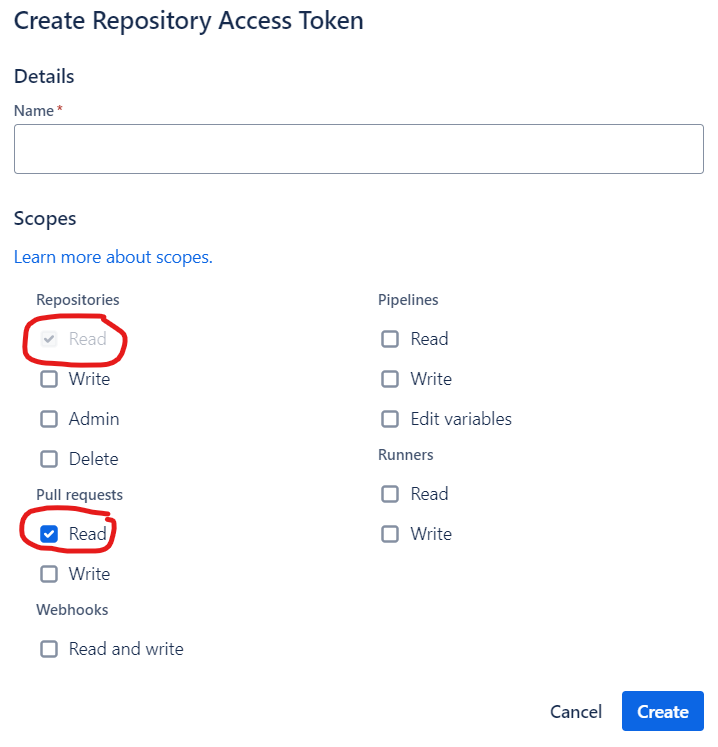
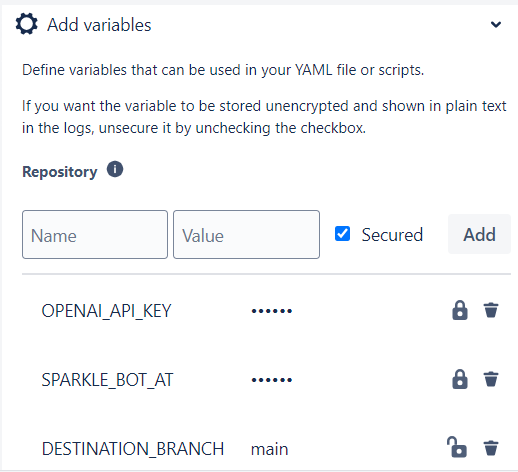
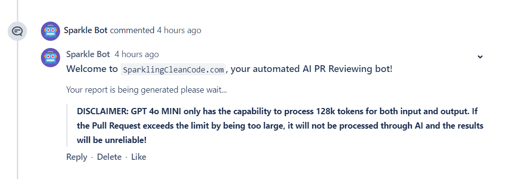

# SparkleBot - AI generated PR-Reviewer

## Step 1

Generate an Access Token for your repository by going to your

> Workspace → Repository → Repository settings → Security → Access Tokens
> 

Generate a personal access token with the following access controls:

- Repository: ***Read***
- Pull Requests: ***Read***

Please note down your access token as it can not be viewed again!

## Step 2

Upload the **config_files** folder and the **bitbucket-pipelines.yml** file to your repository branch. 

Set up the following repository variables in your bitbucket-pipelines.yml file:

- OPENAI_API_KEY - your OpenAI API Key
- SPARKLE_BOT_AT - your repo Access Token
- DESTINATION_BRANCH - your destination branch, for any changes into main/master
- APPROVED_DEVS - PR Authors on whose PR request the pipeline is triggered (example values include -> Rayyan Mohammad Minhaj, Kaab Ahmed, other devs)

## Step 3

Navigate to the branch that contains the pipeline and configuration files (python scripts) and create a change in any “.py” file followed by raising a Pull Request.

If configured correctly, the pipeline should trigger and a disclaimer should be generated within a few seconds, followed by a comprehensive report detailing and summarizing the changes in your code (including change hunks) directly into the PR comment thread.

