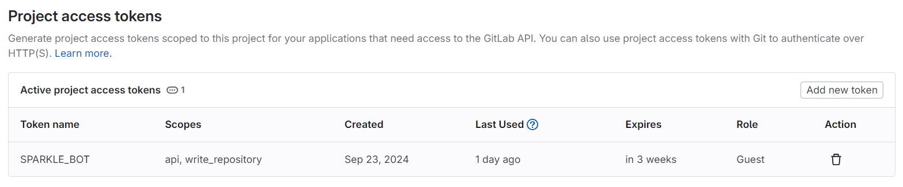
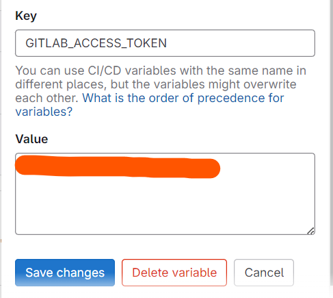

# SparkleBot - AI generated PR-Reviewer

# Step 1

Navigate to the Access Tokens tab of your repository settings and generate a token with `api` and `write_repository` accesses.

> Name the Token SPARKLE_BOT to differentiate between the commenters on MR! 😉
> 

# Step 2

Navigate to the CI/CD Settings of your repository settings and inside the variables tab, add the following variables:

- GITLAB_ACCESS_TOKEN - contains the access token generated from step 1.
- OPENAI_API_KEY - contains your OpenAI API Key

> Ensure that the access settings are set to Masked and Expanded for both the variables. (Protecting the variables will NOT let you access them through other branches)
> 

Add the Key and Value for both `GITLAB_ACCESS_TOKEN` and `OPENAI_API_KEY` as follows

# Step 3

Add the `.gitlab-ci.yml` file + the config_files folder containing two python scripts (`disclaimer.py` and `generate_report.py`) to your main branch AND any other branch that you plan on merging into main!

### Note

> By default the AI PR Reviewer Bot only works for files ending with the “.py” extension, however, this can easily be changed by altering line #35 in the `.gitlab-ci.ym`l file
> 

# Step 4

If configured correctly, the pipeline should trigger and a disclaimer should be generated within a few seconds, followed by a comprehensive report detailing and summarizing the changes in your code (including change hunks) directly into the PR comment thread.

